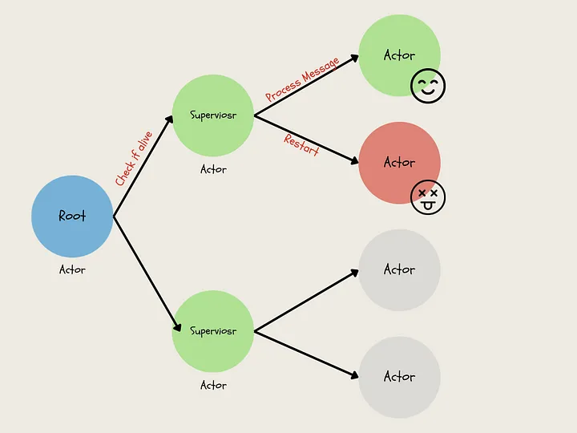

## The Threading Model in Akka Vs Traditional threading models
In traditional threading models threads are managed directly by the operating system or runtime environment. Each thread is a separate unit of execution that can run concurrently with other threads. Threads share memory and state, which can lead to race conditions, deadlocks, and other concurrency issues.

In contrast, Akka's threading model is based on the actor model, which provides a higher-level abstraction for concurrency. Actors are lightweight units of computation that communicate with each other by exchanging messages. Each actor runs in its own thread, which a thread pool manages. Actors are isolated from each other and do not share states, which helps to avoid common concurrency issues.

Here are some key differences between the threading model in Akka and traditional threading models:

- Actors vs. threads: In Akka, concurrency is achieved through actors, while in traditional threading models, concurrency is achieved through threads.

- Message passing vs. shared memory: In Akka, actors communicate with each other by exchanging messages, while in traditional threading models, threads share memory and state.

- Isolation vs. sharing: In Akka, each actor is isolated from other actors and does not share a state, which helps to prevent race conditions and other concurrency issues. In traditional threading models, threads share memory and state, which can lead to concurrency issues.

- Supervision vs. manual management: Akka provides a supervision hierarchy that allows actors to monitor and manage other actors. If an actor encounters an error, its supervisor can take appropriate action. In traditional threading models, error handling and management is typically done manually.

- 

Overall, the actor-based threading model in Akka provides a higher-level abstraction for concurrency that helps to avoid common concurrency issues. By using lightweight actors that communicate through message passing, Akka provides a scalable and fault-tolerant framework for building concurrent applications.

[Refer to the following link](https://medium.com/@nidhey29/how-did-paypal-handle-a-billion-daily-transactions-with-eight-virtual-machines-76b09ce5455c)

